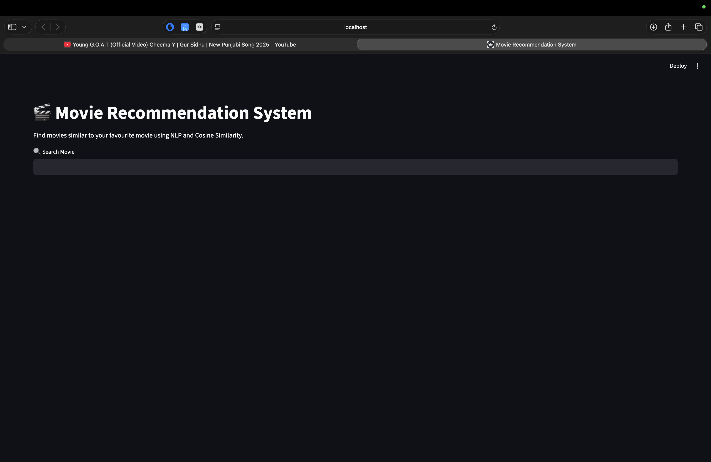
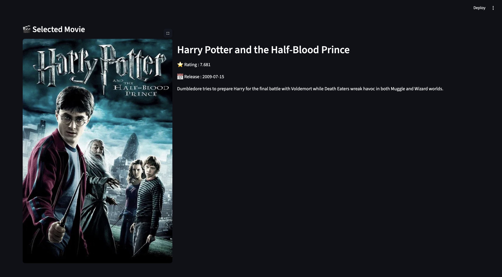

# 🎬 Movie Recommendation System

A **Content-Based Movie Recommendation System** built using **Python, NLP, Scikit-learn, Streamlit, and TMDB API**. The application recommends movies based on their content by analyzing genres, cast, crew, keywords, and movie overviews using Natural Language Processing (NLP) and Cosine Similarity.

---

## 📌 Features

- 🔍 Search movies using partial names
- 🎬 Select a movie from matching search results
- 🤖 Get 20 content-based movie recommendations
- 🖼️ View movie posters
- ⭐ Display movie ratings
- 📅 Display release dates
- 📝 View movie overview
- 🌐 Interactive web interface built with Streamlit
- 🔗 Live movie details fetched using TMDB API

---

## 🛠️ Tech Stack

- Python
- Pandas
- NumPy
- Scikit-learn
- NLTK
- Streamlit
- Requests
- TMDB API
- Pickle

---

## 📂 Project Structure

```
Movie-Recommendation-System/
│
├── app.py
├── requirements.txt
├── README.md
├── .gitignore
├── .env.example
│
├── Data/
│   ├── tmdb_5000_movies.csv
│   └── tmdb_5000_credits.csv
│
├── models/
│   ├── movies.pkl
│   ├── similarity.pkl
│
├── notebooks/
│   └── movie_recommendation.ipynb
│
├── src/
│   ├── recommender.py
│   ├── tmdb_api.py
│   ├── config.py
│
└── tests/
```

---

## ⚙️ How It Works

1. Load the TMDB movie datasets.
2. Clean and preprocess the data.
3. Extract important features:
   - Genres
   - Keywords
   - Cast
   - Director
   - Overview
4. Combine features into a single text column.
5. Apply text preprocessing using:
   - Tokenization
   - Stemming
6. Convert text into numerical vectors using **CountVectorizer**.
7. Compute **Cosine Similarity** between all movies.
8. Recommend the most similar movies based on similarity scores.
9. Fetch movie posters and metadata from the TMDB API.
10. Display recommendations through a Streamlit web application.

---

## 🧠 Machine Learning Concepts Used

- Natural Language Processing (NLP)
- Feature Engineering
- Count Vectorization
- Cosine Similarity
- Content-Based Filtering

---

## 📷 Screenshots

### Home Page



---

### Selected Movie



---

### Recommendations


---

## 🚀 Installation

Clone the repository

```bash
git clone https://github.com/yourusername/Movie-Recommendation-System.git
```

Move into the project directory

```bash
cd Movie-Recommendation-System
```

Create a virtual environment (optional)

```bash
conda create -n movie_env python=3.11
conda activate movie_env
```

Install the required libraries

```bash
pip install -r requirements.txt
```

Create a `.env` file

```text
TMDB_API_KEY=YOUR_API_KEY
```

Run the application

```bash
streamlit run app.py
```

---

## 📊 Dataset

Dataset used:

- TMDB 5000 Movies Dataset
- TMDB 5000 Credits Dataset

---

## 🌐 API Used

TMDB (The Movie Database) API

Used for:

- Movie Posters
- Ratings
- Release Dates
- Movie Overview

---

## 📈 Future Improvements

- Hybrid Recommendation System
- Fuzzy Search
- Genre-Based Filtering
- Actor-Based Filtering
- Similar Collections
- Movie Trailers
- User Authentication
- User Watchlist
- AWS Deployment
- Docker Support
- Responsive UI

---

## 👨‍💻 Author

**Divyanshu Kumar**

B.Tech CSE | Data Science & Machine Learning Enthusiast

GitHub: https://github.com/yourusername

LinkedIn: https://linkedin.com/in/yourprofile

---

## 🚀 Live Demo

🌐 https://movie-recommendation-system-d5eriqgjsi3awkfjtzkugg.streamlit.app/
